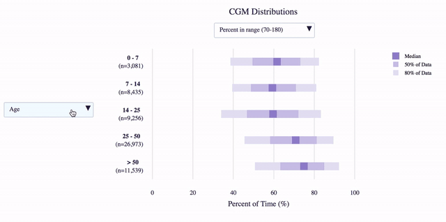
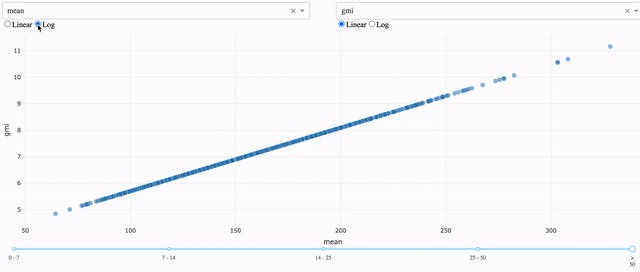

# Exploration of Dash Data Visualization Framework for Viewing Tidepool Donor Data
#### -- Project Status: Active
#### -- Project Disclaimer: This work is for Exploration

## Project Objective
The purpose of this project is to explore the use of the plotly Dash visualization framework 
for building data visualization web applications as a way to share and explore Tidepool Donor Data.

## Definition of Done
This phase of the project will be done when the exploratory phase of the Dash tools
is completed to a point that the work should be incorporated into Data Science Team 
visualization tools (`data-science--tool--visualization-tools`).

## Project Description
The repository includes example
Dash applications (`dash-example1.py`, `dash-example2.py`, `dash-example3.py`, `dash-example4.py`).
The standard Dash examples are from the Dash framework tutorials from this 
[Dash User Guide](https://dash.plotly.com/). 

The repository also includes two different work in progress exploratory visualizations of the Tidepool donor
data (`visualize-donor-data-barplot.py`,`visualize-donor-data-scatterplot.py`). 

 

### Technologies (Update this list)
* Python (99% of the time)
* [Anaconda](https://www.anaconda.com/) for our virtual environments
* Pandas for working with data (99% of the time)
* Google Colab for sharing examples
* Plotly for visualization
* Dash for visualization/web applications

Not currently using but may further along in project (update as needed):
* Pytest for testing
* Travis for continuous integration testing
* Black for code style
* Flake8 for linting
* [Sphinx](https://www.sphinx-doc.org/en/master/) for documentation
* Numpy docstring format
* pre-commit for githooks
* GitHub pages for sharing visualizations

## Getting Started with the Conda Virtual Environment
1. Install [Miniconda](https://conda.io/miniconda.html). CAUTION for python virtual env users: Anaconda will automatically update your .bash_profile
so that conda is launched automatically when you open a terminal. You can deactivate with the command `conda deactivate`
or you can edit your bash_profile.
2. If you are new to [Anaconda](https://docs.anaconda.com/anaconda/user-guide/getting-started/)
check out their getting started docs.
3. If you want the pre-commit githooks to install automatically, then following these
[directions](https://pre-commit.com/#automatically-enabling-pre-commit-on-repositories).
4. Clone this repo (for help see this [tutorial](https://help.github.com/articles/cloning-a-repository/)).
5. In a terminal, navigate to the directory where you cloned this repo.
6. Run `conda update -n base -c defaults conda` to update to the latest version of conda
7. Run `conda env create -f conda-environment.yml --name [input-your-env-name-here]`. This will download all of the package dependencies
and install them in a conda (python) virtual environment. (Insert your conda env name in the brackets. Do not include the brackets)
8. Run `conda env list` to get a list of conda environments and select the environment
that was created from the environmental.yml file (hint: environment name is at the top of the file)
9. Run `conda activate <conda-env-name>` or `source activate <conda-env-name>` to start the environment.
10. If you did not setup your global git-template to automatically install the pre-commit githooks, then
run `pre-commit install` to enable the githooks.
11. Run `deactivate` to stop the environment.

## Maintaining Compatability with venv and virtualenv
This may seem counterintuitive, but when you are loading new packages into your conda virtual environment,
load them in using `pip`, and export your environment using `pip-chill > requirements.txt`.
We take this approach to make our code compatible with people that prefer to use venv or virtualenv.
This may also make it easier to convert existing packages into pypi packages. We only install packages directly
in conda using the conda-environment.yml file when packages are not available via pip (e.g., R and plotly-orca).

## Getting Started with this project
The aggregated Tidepool Donor Data
needed to run the the dash apps is kept on Tidepool's Internal
Google Drive [here](https://drive.google.com/file/d/1rGGAWDNDre51nqndS4QJtnVwibJbla-P/view?usp=sharing).

## Contributing Guide
1. All are welcome to contribute to this project.
1. Naming convention for notebooks is
`[short_description]-[initials]-[date_created]-[version]`,
e.g. `initial_data_exploration-jqp-2020-04-25-v-0-1-0.ipynb`.
A short `_` delimited description, the creator's initials, date of creation, and a version number,
1. Naming convention for data files, figures, and tables is
`[PHI (if applicable)]-[short_description]-[date created or downloaded]-[code_version]`,
e.g. `raw_project_data_from_mnist-2020-04-25-v-0-1-0.csv`,
or `project_data_figure-2020-04-25-v-0-1-0.png`.

NOTE: PHI data is never stored in github and the .gitignore file includes this requirement as well.

## Featured Notebooks/Analysis/Deliverables

## Tidepool Data Science Team
|Name (with github link)    |  [Tidepool Slack](https://tidepoolorg.slack.com/)   |
|---------|-----------------|
|[Ed Nykaza](https://github.com/ed-nykaza)| @ed        |
|[Jason Meno](https://github.com/jameno) |  @jason    |
|[Cameron Summers](https://github.com/scaubrey) |  @Cameron Summers    |
|[Anne Evered](https://github.com/aeevered) |  @anne    |

